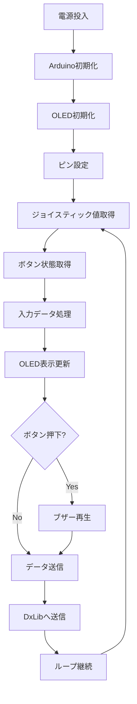
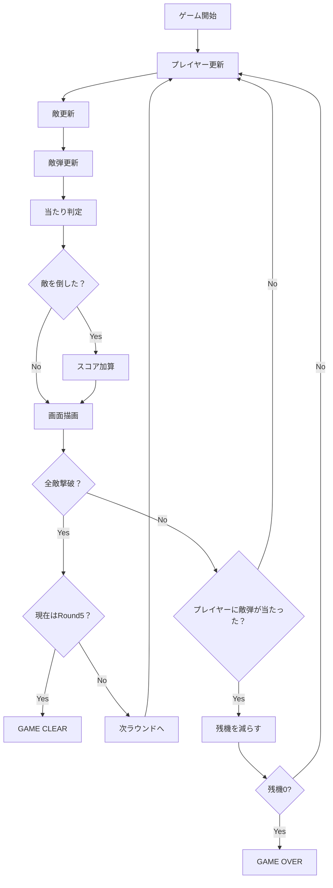
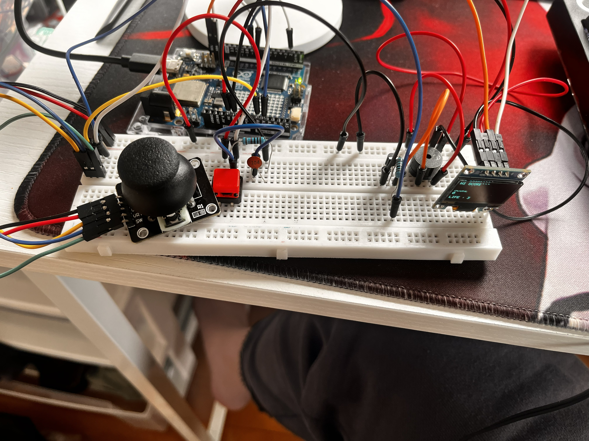
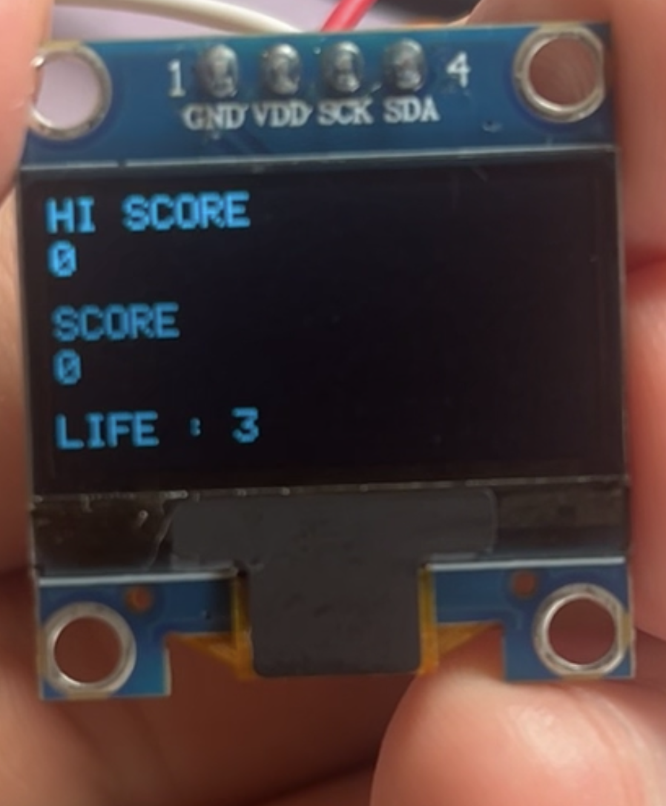

# インベーダーゲーム

## 概要

- C++ と DxLib を使用して制作し、Arduino Uno R4 WiFiをコントローラーとして使用するインベーダゲーム風なゲームです。  
- Visual Studio　Community 2026（MSVC）環境で開発しています。
- arduino_secrets.h にコピーして自分の環境を設定してください
- zip があるので興味があればぜひプレイしてみてください!!

---

## 開発環境

- OS：Windows 10 / 11
- IDE：Visual Studio Community 2026
- 言語：C++
- ライブラリ：DxLib
- ビルド：x64

---

## Arduino環境

### 使用ボード

- Arduino Uno R4 WiFi

### Arduino IDE

- Arduino IDE 2.3.10

### 必要ライブラリ

- ライブラリマネージャーから以下をインストールしてください。
- WiFiS3
- Adafruit SSD1306
- Adafruit GFX Library

---

## arduino_secrets.h の設定

- Arduinoフォルダ内のarduino_secrets.h自分の環境に合わせて編集してください。

- **例**：

```cpp
#define SECRET_SSID "WiFi名"
#define SECRET_PASS "WiFiパスワード"

#define PC_IP_1 192
#define PC_IP_2 168
#define PC_IP_3 1
#define PC_IP_4 10

#define PORT 5000

```

---

## PCのIPアドレス確認

```c
Windowsで
1. Win + R
2. cmd
3. ipconfig
を実行
IPv4アドレスを確認して
arduino_secrets.h に設定してください。
```

---

## 実行手順

1. Arduino IDEでコントローラープログラムを書き込む
2. arduino_secrets.h を自分の環境に合わせて設定する
3. シリアルモニタを開く
4. 以下が表示されることを確認

    ```c
    WiFi Connected
    Arduino IP : xxx.xxx.xxx.xxx
    UDP Ready
    ```

5. invader.zip をダウンロード
6. 解凍する
7. Shooting.exe を起動する
8. Arduinoコントローラーで操作する

## Visual Studio側の設定

### 実行方法

1. GitLabからinvader.zipをダウンロード
2. zipを解凍
3. フォルダー内のShooting.exeを起動

### 注意事項

- ArduinoとPCは同じWi-Fiに接続してください
- ファイアウォールで通信がブロックされる場合があります
- 音量が大きい場合があるため、PC側で調整してください

### 動作の確認

- Arduinoのシリアルモニタで

  ```c
  SEND : 20B20A1
  ```

- のような表示が流れていれば送信成功です
- 起動後、
  - ジョイスティックでプレイヤーが移動
  - ボタンで弾発射
- ができれば正常に接続されています

---

## 操作方法

### Arduinoコントローラー

- ジョイスティック左右：移動
- ボタン: 決定/弾発射

### キーボード

- A/D
- ←/→
- でプレイヤー移動

### マウス

- 左クリック ： 決定：弾発射

---

## 使用モジュール

- Arduino Uno R4 WiFi 1個
- ボタン 1個
- パッシブブザー 1個
- トランジスタ 1個
- OLED Screen 1個
- コンデンサ 1個
- ジャンパーワイヤー　複数
- 抵抗 10KΩ 1KΩ

## システムフローチャート



---

## インベーダーゲームのフローチャート



---

## フォルダ構成

```text
コードの構成
Shooting
├── Data
│   ├── Images
│   │   ├── enemy_orange.png
│   │   ├── enemy_red.png
│   │   ├── enemy_white.png
│   │   ├── enemy_yellow.png
│   │   ├── player_ship.png
│   │   └── UFO.png
│   └── Sound
│       ├── BGM
│       │   ├── Game.mp3
│       │   ├── Title.mp3
│       │   └── Ufo.mp3
│       └── SE
│           ├── Damage.mp3
│           ├── Destroy.mp3
│           ├── Enemy.mp3
│           ├── Enemyextinction.mp3
│           ├── Gameclear.mp3
│           ├── Gameover.mp3
│           ├── Player.mp3
│           └── Selection.mp3
├── src
│   ├── Common
│   │   ├── Vector2.cpp
│   │   └── Vector2.h
│   ├── Manager
│   │   ├── InputManager.cpp
│   │   ├── InputManager.h
│   │   ├── NetworkManager.cpp
│   │   ├── NetworkManager.h
│   │   ├── RoundManager.cpp
│   │   ├── RoundManager.h
│   │   ├── SceneManager.cpp
│   │   ├── SceneManager.h
│   │   ├── SoundManager.cpp
│   │   └── SoundManager.h
│   ├── Objekct
│   │   ├── BonusEnemy.cpp
│   │   ├── BonusEnemy.h
│   │   ├── Bullet.cpp
│   │   ├── Bullet.h
│   │   ├── Enemy.cpp
│   │   ├── Enemy.h
│   │   ├── EnemyBullet.cpp
│   │   ├── EnemyBullet.h
│   │   ├── EnemyManager.cpp
│   │   ├── EnemyManager.h
│   │   ├── Player.cpp
│   │   ├── Player.h
│   │   ├── Shield.cpp
│   │   └── Shield.h
│   ├── Scene
│   │   ├── GameClear.cpp
│   │   ├── GameClear.h
│   │   ├── GameOver.cpp
│   │   ├── GameOver.h
│   │   ├── GameSenen.cpp
│   │   ├── GameSenen.h
│   │   ├── Title.cpp
│   │   └── Title.h
│   ├── Application.cpp
│   ├── Application.h
│   ├── main.cpp
│   └── main.h
```

---

## 回路





## ゲームクリアになると鳴る音


https://github.com/user-attachments/assets/d770caa9-798d-49e9-a23f-e2b7e1104825


## ゲームオーバーになると鳴る音


https://github.com/user-attachments/assets/281c3335-573d-4869-9116-3d8846bffe26


## ゲームシーン


https://github.com/user-attachments/assets/4e64e94c-1565-4802-a4a0-e96e5ec58932


